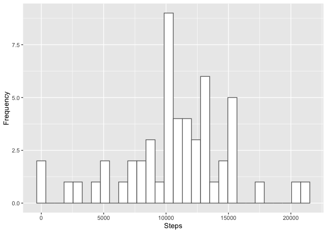
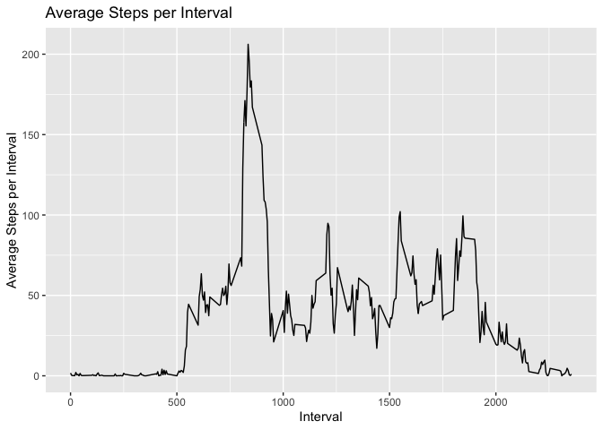
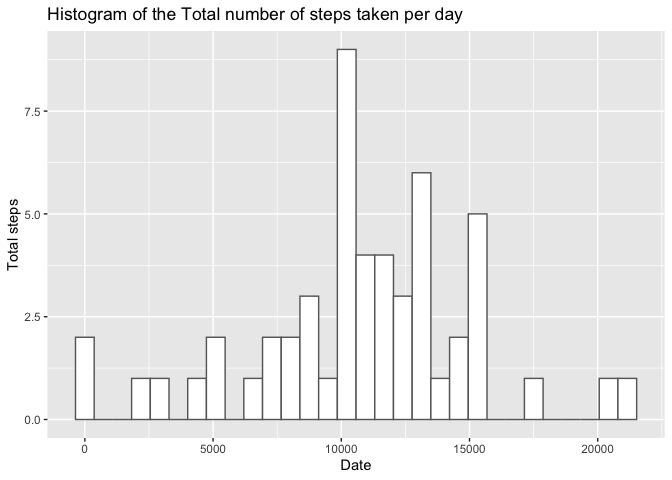
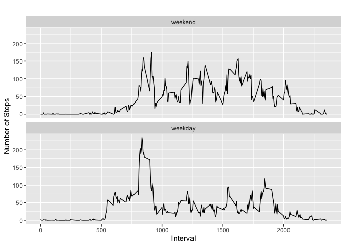

## Loading and preprocessing the data


```r
library(ggplot2)

data <- read.table("activity.csv",header=TRUE,sep=",")
head(data)
```

```
##   steps       date interval
## 1    NA 2012-10-01        0
## 2    NA 2012-10-01        5
## 3    NA 2012-10-01       10
## 4    NA 2012-10-01       15
## 5    NA 2012-10-01       20
## 6    NA 2012-10-01       25
```

## What is mean total number of steps taken per day?

*1. Calculate the total number of steps taken per day

```r
total_steps_per_day <- aggregate(steps~date, data = data, FUN=sum)
```

*1. Make a histogram of the total number of steps taken each day

#hist(x = total_steps_per_day$steps)

```r
ggplot(data = total_steps_per_day, aes(steps)) +
geom_histogram(bins = 30, color = "#666666", fill = "white", show.legend = FALSE, na.rm = FALSE) + labs(
     y = "Frequency",
     x = "Steps") 
```

<!-- -->

*2. Calculate and report the **mean** and **median** total number of steps taken per day


```r
# Mean
mean_total_nb_steps <- mean(total_steps_per_day$steps, na.rm = TRUE)
# Median
median_total_nb_steps <- median(total_steps_per_day$steps, na.rm = TRUE)
```

## What is the average daily activity pattern?

#Make a time series plot (i.e. type = "l") of the 5-minute interval (x-axis) and the average number of steps taken, averaged across all days (y-axis)


```r
interval_data <- data[data$interval==5,]
head(interval_data)
```

```
##      steps       date interval
## 2       NA 2012-10-01        5
## 290      0 2012-10-02        5
## 578      0 2012-10-03        5
## 866      0 2012-10-04        5
## 1154     0 2012-10-05        5
## 1442     0 2012-10-06        5
```


```r
average_by_total_steps_per_interval <- aggregate(steps~interval, data = data, FUN=mean)
```


```r
ggplot(data = average_by_total_steps_per_interval , aes(x = interval, y = steps)) +
geom_line() +
labs(title = "Average Steps per Interval",
     y = "Average Steps per Interval",
     x = "Interval") 
```

<!-- -->
     
*Which 5-minute interval, on average across all the days in the dataset, contains the maximum number of steps?


```r
#max
max_steps_per_interval <- average_by_total_steps_per_interval[average_by_total_steps_per_interval$steps == max(average_by_total_steps_per_interval$steps),]$interval
datetime_max_steps <- as.POSIXct(max_steps_per_interval, origin = "1970-01-01", tz = "GMT")
datetime_max_steps <- strftime(datetime_max_steps, format="%H:%M", tz = "GMT")
```

## Imputing missing values

*Calculate and report the total number of missing values in the dataset (i.e. the total number of rows with `NA`s)


```r
total_na_steps <- sum(is.na(data$steps))
total_na_date <- sum(is.na(data$date))
total_na_interval <- sum(is.na(data$interval))
```

*Devise a strategy for filling in all of the missing values in the dataset. The strategy does not need to be sophisticated. For example, you could use the mean/median for that day, or the mean for that 5-minute interval, etc. : Filling using the mean for that interval

*Create a new dataset that is equal to the original dataset but with the missing data filled in.


```r
new_data <- data 

new_data[is.na(new_data$steps),]$steps <- average_by_total_steps_per_interval$steps[match(new_data[is.na(new_data$steps),]$interval, average_by_total_steps_per_interval$interval)]
```

*Make a histogram of the total number of steps taken each day and Calculate and report the **mean** and **median** total number of steps taken per day. Do these values differ from the estimates from the first part of the assignment? What is the impact of imputing missing data on the estimates of the total daily number of steps?


```r
total_steps_per_day <- aggregate(steps~date, data = data, FUN=sum)
```


```r
ggplot(data = total_steps_per_day, aes(steps)) +
geom_histogram(bins = 30, color = "#666666", fill = "white", show.legend = FALSE, na.rm = FALSE)+
 labs(title = "Histogram of the Total number of steps taken per day",
       y = "Total steps",
       x = "Date")
```

<!-- -->


```r
# Mean
mean_total_nb_steps <- mean(total_steps_per_day$steps, na.rm = TRUE)
# Median
median_total_nb_steps <- median(total_steps_per_day$steps, na.rm = TRUE)
```

## Are there differences in activity patterns between weekdays and weekends?

*1. Create a new factor variable in the dataset with two levels -- "weekday" and "weekend" indicating whether a given date is a weekday or weekend day.


```r
week_data <- data 
week_data$date <- as.Date(week_data$date)

week_days <- c("Segunda Feira","Terça Feira","Quarta Feira","Quinta Feira","Sexta Feira")

week_data$weekday_type <- factor((weekdays(week_data$date) %in% week_days),levels=c(FALSE, TRUE),labels=c('weekend', 'weekday'))

head(week_data)
```

```
##   steps       date interval weekday_type
## 1    NA 2012-10-01        0      weekday
## 2    NA 2012-10-01        5      weekday
## 3    NA 2012-10-01       10      weekday
## 4    NA 2012-10-01       15      weekday
## 5    NA 2012-10-01       20      weekday
## 6    NA 2012-10-01       25      weekday
```
         

*1. Make a panel plot containing a time series plot (i.e. `type = "l"`) of the 5-minute interval (x-axis) and the average number of steps taken, averaged across all weekday days or weekend days (y-axis). The plot should look something like the following, which was created using **simulated data**:


```r
average_by_total_steps_per_weekday <- aggregate(steps~interval+weekday_type, data = week_data, FUN=mean)
```


```r
ggplot(data = average_by_total_steps_per_weekday , aes(x = interval, y = steps)) +
geom_line() +
labs(title = "",
     y = "Number of Steps",
     x = "Interval")  +  facet_wrap(~weekday_type,  ncol=1)
```

<!-- -->
